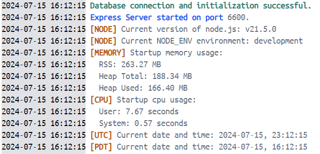

# serverStartupLogs

The `serverStartupLogs` function is used on server start up to log useful information about the server.

Here is an example of what the logs will look like:



## Import

```JavaScript
// ESModule Syntax (preferred)
import { serverStartupLogs } from "@bcgov/citz-imb-express-utilities";

// CommonJS Syntax
const { serverStartupLogs } = require('@bcgov/citz-imb-express-utilities');
```

## Usage

A basic example of using the `serverStartupLogs` function.

```JavaScript
import app from './express';
import { serverStartupLogs } from "@bcgov/citz-imb-express-utilities";
const { PORT } = process.env;

app.listen(PORT, () => {
  try {
    // Log server start information.
    serverStartupLogs(PORT);
  } catch (error) {
    // Log any error that occurs during the server start.
    console.error(error);
  }
});
```

## TypeScript Type

<!-- The following code block is auto generated when types in the package change. -->
<!-- TYPE: serverStartupLogs -->
```TypeScript
const serverStartupLogs: (port?: number | string) => void;
```

## Parameters

An API reference for the parameters of the `serverStartupLogs` function.

!!! note "Note"
    The Name column starting with `*` means the prop is required.

<table>
  <!-- Table columns -->
  <thead>
    <tr>
      <th style="background: #6f19d9; color: white;">Name</th>
      <th style="background: #6f19d9; color: white;">Type</th>
      <th style="background: #6f19d9; color: white;">Default</th>
      <th style="background: #6f19d9; color: white;">Description</th>
    </tr>
  </thead>

  <!-- Table rows -->
  <tbody>
    <tr>
      <td>port</td>
      <td>number | string</td>
      <td>-</td>
      <td>Port the express server is running on.</td>
    </tr>
  </tbody>
</table>

<!-- Link References -->
